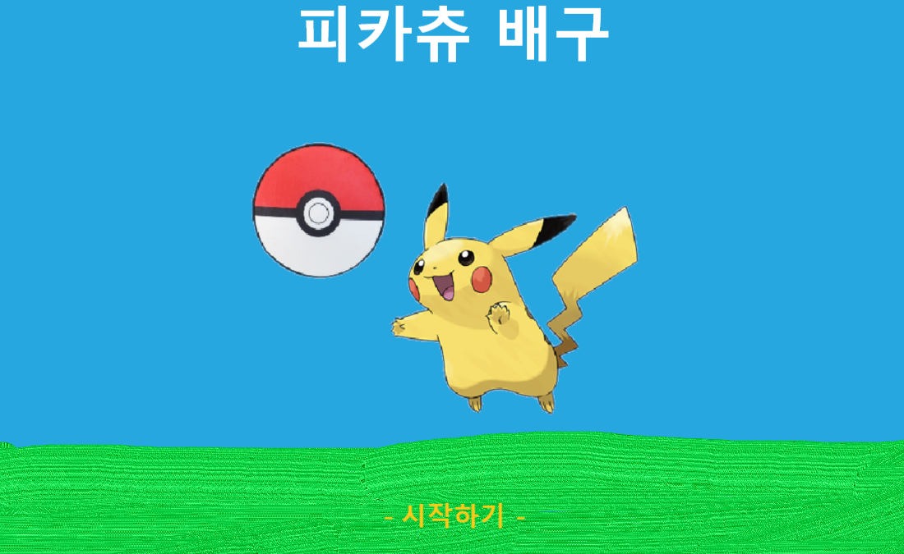
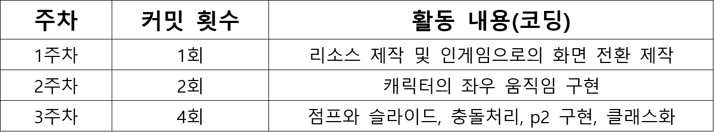
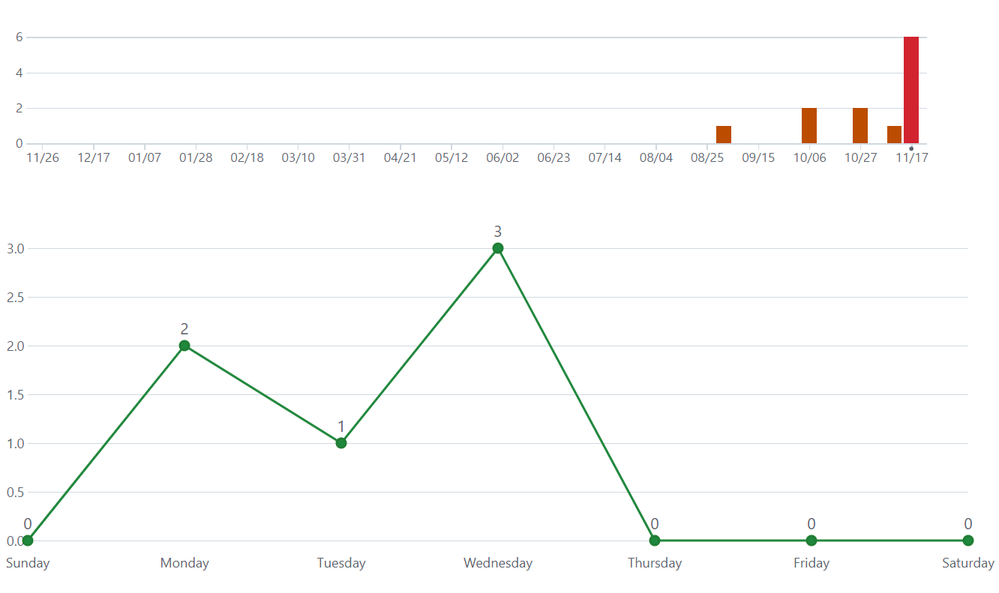

# 2D_GameProgramming
2D게임프로그래밍

---게임 이름: 피카츄 배구---
피카츄배구는 1997년 일본에서 만들어진 게임으로 많은 이들이 사랑했던 게임입니다. 피카츄 두 마리가 서로 배구를 하면서 특정 점수를 따내면 승리하는 게임입니다. 

위 스크린샷처럼 구현하되 2인플레이 기능으로 제작할 예정입니다.

---예상 게임 실행 흐름---
기본적으로 1대1 2인 플레이 게임입니다. 따라서 ai와의 대전과는 달리 난이도 기능은 없습니다. 
1번 플레이어는 w,a,s,d로 2번 플레이어는 방향키를 사용하여 피카츄를 이동하게 하고 1번플레이어는 r키를 2번플레이어는 shift를 사용하여 배구공을 강하게 칠 수 있게(스메싱) 제작할 예정입니다. 스메싱을 사용할 경우 공이 더욱 빠르게 날아가며 상대가 받을 시 다시 원래 공의 속도로 돌아가게 됩니다.

---기본적인 룰---
리시브 횟수 제한은 따로 없습니다. 
8점 먼저 득점시 승자가 결정되고 게임이 종료됩니다.

---Scene---
시작 화면 

시작하기를 누르면 인게임으로 들어가게 됩니다.

인게임 화면 위의 피카츄 배구 스크린샷과 비슷하게 제작될 예정입니다.
승자가 정해지면 인게임 화면 중앙에 승자가 나타납니다.

pico2d라이브러리를 사용할 예정입니다.

---예상 사용 class---
ISCollasion (충돌체크(플레이어와 공, 네트와 공, 맵과 플레이어))
Player1, Player2
Ball
Score (점수)

---개발 계획---

11월 둘째주 
--> 게임 인트로 및 인게임 배경 제작 및 구현 

11월 셋째주
--> 플레이어(피카츄) 기본적인 움직임 구현

11월 넷째주
--> 공과 피카츄의 충돌 구현 및 공의 움직임 제작

11월 다섯째주 & 12월 첫째주
--> 스파이크 모션 구현 및 점수, 게임 승리조건 제작

---활동 정리---
게임 선정 및 게임 시작화면 제작, 게임 룰 설정

11월 둘쨋주 활동정리
각 리소스 다운 및 제작
시작화면에서 enter를 누를시 ingame화면으로 전환
약 5%
    
11월 셋째주 활동정리
P1 좌우 움직임 구현 
각종 다른 과목 과제와 지스타로 인해서 움직임 완벽구현은 하지 못했습니다.(점프와 슬라이딩)
약 20%

11월 넷째주 활동 
p1,p2 제작 완벽 움직임 구현 완료, 충돌체크 구현
약 60% 구현

11월 다섯째주 활동 정리
점수판 및 룰 제작

12월 둘쨋주
공의 속도 변경, 스킬 생성, 음향 추가, 쿨타임 생성

1차 발표 링크
https://youtu.be/TbQ4SWjJzlM

2차 발표 링크(긴 버전)
https://youtu.be/I3YCfgg8i_8
2차 발표 링크(짧은 버전)
https://youtu.be/p4n0rd3YLVs

== 2차 발표 자료 ==

== 최종발표 발표 자료 ==
사용된 기술:
클래스, 충돌처리

수업내용에서 차용한 것들:
코드 문법들

직접 개발한 내용:
각 클래스를 직접 만들고 해당 역할에 맞게 생성

- 커밋횟수 -
1주차 - 1회
2주차 - 2회
3주차 - 4회
4주차 - 1회
5주차 - 0회
6주차 - 2회

팔기 위해 보충할 것들
1. 난이도 조절을 한 ai 제작
2. 더욱 자연스러운 움직임

이번 수업에서 기대한 것
    파이썬을 사용하며 파이썬에 대한 이해도와 클래스에 대한 이해도를 높여 실력 향상

더 좋은 수업이 되기 위해 변화할 점
- 교수님의 코드는 코드를 어떻게 짜야하는지 학습하기에는 매우 유용하지만 입문할 당시에는 익숙하지 않아 코드를 해석하고 공부하기에 어려움이 있었습니다. 따로 ppt 또는 정리 노트가 있으면 이해하기에 큰 도움이 될 것 같았습니다.

명령어
p1
w - 점프
a,d- 좌우 움직임
s - 슬라이딩
e - 스킬
r - 스파이크

p2 
i - 점프
j,l - 좌우 움직임
k - 슬라이딩
o - 스킬
p - 스파이크