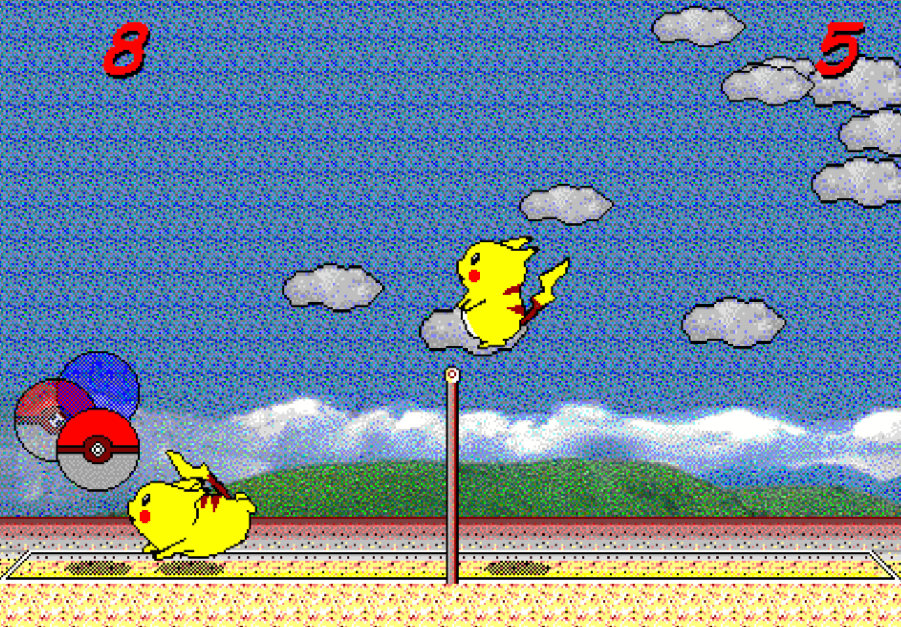
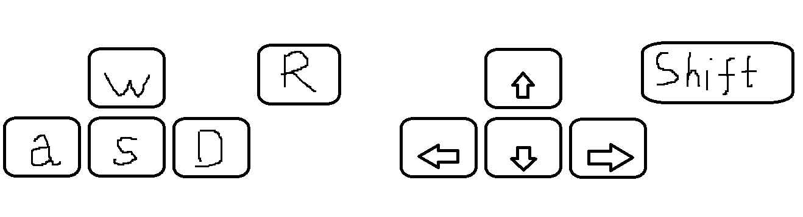

# 2D_GameProgramming
2D게임프로그래밍

---게임 이름: 피카츄 배구---
피카츄배구는 1997년 일본에서 만들어진 게임으로 많은 이들이 사랑했던 게임입니다. 피카츄 두 마리가 서로 배구를 하면서 특정 점수를 따내면 승리하는 게임입니다. 

위 스크린샷처럼 구현하되 2인플레이 기능으로 제작할 예정입니다.

---예상 게임 실행 흐름---
기본적으로 1대1 2인 플레이 게임입니다. 따라서 ai와의 대전과는 달리 난이도 기능은 없습니다. 
1번 플레이어는 w,a,s,d로 2번 플레이어는 방향키를 사용하여 피카츄를 이동하게 하고 1번플레이어는 r키를 2번플레이어는 shift를 사용하여 배구공을 강하게 칠 수 있게(스메싱) 제작할 예정입니다. 스메싱을 사용할 경우 공이 더욱 빠르게 날아가며 상대가 받을 시 다시 원래 공의 속도로 돌아가게 됩니다.

---기본적인 룰---
리시브 횟수 제한은 따로 없습니다. 
8점 먼저 득점시 승자가 결정되고 게임이 종료됩니다.

---Scene---
시작 화면 

시작하기를 누르면 인게임으로 들어가게 됩니다.

인게임 화면 위의 피카츄 배구 스크린샷과 비슷하게 제작될 예정입니다.
승자가 정해지면 인게임 화면 중앙에 승자가 나타납니다.

pico2d라이브러리를 사용할 예정입니다.

---예상 사용 class---
ISCollasion (충돌체크(플레이어와 공, 네트와 공, 맵과 플레이어))
Player1, Player2
Ball
Score (점수)

---개발 계획---

11월 둘째주 
--> 게임 인트로 및 인게임 배경 제작 및 구현 

11월 셋째주
--> 플레이어(피카츄) 기본적인 움직임 구현

11월 넷째주
--> 공과 피카츄의 충돌 구현 및 공의 움직임 제작

11월 다섯째주 & 12월 첫째주
--> 스파이크 모션 구현 및 점수, 게임 승리조건 제작

1차 발표 링크
https://youtu.be/TbQ4SWjJzlM

활동 정리
게임 선정 및 게임 시작화면 제작, 게임 룰 설정

11월 둘쨋주 활동정리
각 리소스 다운 및 제작
시작화면에서 enter를 누를시 ingame화면으로 전환
    